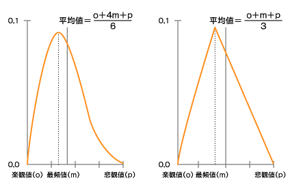

<html><body>
<h2>破たんした見積もりはプロジェクト失敗への近道</h2>
<!-- cxenseparse_start -->
<h3>プロジェクトの見積もり</h3>

　国際的なプロジェクトマネジメント標準であるPMBOK（Project Management Body of Knowledge：プロジェクトマネジメント知識体系）では、プロジェクトの見積もり精度については、以下のように示されている。

<table id="tbl75c" class="cmsTable cmsTableC cmsTable75">
<caption></caption>
<thead><tr>
<th id="null" width="35%"><strong>見積もりの種類</strong></th>
<th id="null"><strong>精度</strong></th>
</tr></thead><tbody><tr>
<th id="null">超概算見積もり</th>
<td id="null">−50〜＋100％</td>
</tr><tr>
<th id="null">予算見積もり</th>
<td id="null">−10〜＋25％</td>
</tr><tr>
<th id="null">確定見積もり</th>
<td id="null">−5〜＋10％</td>
</tr></tbody>
<tfoot><tr><td colspan="2"></td></tr></tfoot>
</table>

 

　建築業界では、ほとんどの工事は見積もり額の−10〜＋10％に入るといわれており、多少誤差があるが、このPMBOKの定義とほぼ一致している。これに対しシステム開発では、最終的にはどのくらいの見積もり精度なのだろうか。感覚値だが、たぶん、−20〜＋100％ぐらいになっているのではないだろうか。

　それでは、なぜシステム開発においては、見積もり精度が出ないのであろうか。これには、いくつかの理由が考えられる。

<h4>（1）機能の洗い出しが不十分</h4>

　確定見積もりを算出するためには、プロジェクトで開発するシステムの機能とその難易度が分からないといけない。しかし、見積もりを算出する段階で、そもそも機能は明確になっているだろうか。機能が明確でないのに見積もりを提出しているとすれば、その精度はそもそも期待できなくて当然である。

<h4>（2）見積もり技術が確立していない</h4>

　システム開発においては、見積もる人によって金額に倍の開きが出た、というような話をよく聞く。大まかな機能内容を見て、「エイヤ！」で見積もるなんていうのは、乱暴このうえない話であり、人によって大きなばらつきが出るのは当然である。

　このような見積もりをしている限り、見積もり精度の向上は期待できない。最近はファンクションポイントなどの、もう少し客観的な見積もり手法も広まってきている。しかし、ファンクションポイントなどの方法を採用したとしても、会社全体できちんとした見積もり基準を確立している会社は、まだ多くないのではないだろうか。

<h4>（3）予備をきちんと確保しない</h4>

　プロジェクトの特徴は、期限が決まっているという「有期性」と、毎回違う仕事をするという「独自性」だといわれる。この独自性が、プロジェクトのリスクの大きな要因となっている。つまり、毎回同じ仕事をしているのであれば、だんだんと仕事にも慣れて、失敗をする確率が下がるのであるが、プロジェクトは常に新しい、違う仕事をするために、どうしてもリスクが高くなり、失敗する可能性も高くなるのである。

　このようにプロジェクトにはリスクが存在するので、それに対処するために何らかの予備を用意しておく必要がある。ところが、日本ではリスクマネジメントの考え方があまり定着していないために、このような予備を上乗せすると、「何を甘いことを考えているのだ。そんなリスクが発生しないように頑張れ」などといわれてしまうのだ。

<h4>（4）見積もりの数字的な欠陥</h4>

　定常作業のタスクのコストや納期のばらつきは、正規分布に従うといわれる。これに対して、プロジェクトのタスクのばらつきは、ベータ分布または三角分布に従うといわれ、左右非対称になる（図）。

<!--CAP-->

<small><strong>図　左のグラフがベータ分布で、右のグラフが三角分布で、どちらもプロジェクトのタスクのばらつきを表す</strong></small>

<!--CAPEND-->

　この分布の平均は最頻値よりも大きくなる。従って、この最頻値を積み上げた見積もりを守れる確率は50％以下になる。一般的に、この最頻値を積み上げた見積もりが守れる確率は、10〜15％程度といわれている。

　つまり、予備を持たない最頻値を使った通常の見積もりをしているとすれば、それは10〜15％程度しか守れる確率がない見積もりを作っていることになる。

<h3>正確な見積もりを作成する方策</h3>
<h4>（1）漏れのない機能の洗い出しを行う</h4>

　正確な見積もりの第一歩は、必要な機能を漏れなく洗い出すことである。そのためには、要件定義が漏れなく行われていなければならない。これができていなければ、そもそも正確な見積もりを行うことはできない。

　しかし実際には、前回（「<A HREF="../../0711/12/news109.md">システム化範囲がぶれていれば失敗する</A>」）も指摘したとおり、要件が完全に確定していない段階で見積もりを行わなければならない場合もある。この場合は、リスクを見込んだ見積もりを作成することになる。もし、要件も確定していない超概算見積もりを作成するのであれば、＋100％のブレが出ることを想定して見積もりを行うことになる。

<h4>（2）見積もり技法の確立</h4>

　現在のようにWeb中心の開発では、従来のようなステップ数を基にした見積もりはあまり意味がなくなっている。そのため、多くの会社がファンクションポイント法などの、画面、帳票や機能数をベースにした見積もりを採用してきているのではないだろうか。

　ここで問題は、この方法が会社内で標準化されているかどうかである。多くの会社は、担当者や部署ごとにばらばらな見積もりをしているのではないか。なぜ標準化が必要かというと、会社として標準化した方法を採用していないと、生産性のデータが取れなくなり、見積もりの精度を上げていくことが難しくなるからである。

<h4>（3）適正な予備の確保</h4>

　すでに述べたように適正な予備を確保することは、プロジェクトにとって必須である。予備には、コンティンジェンシー予備とマネジメント予備の2種類がある。前者はリスクマネジメントの一環で洗い出したリスクに対応して取る予備であり、各リスクの内容を見て予備を設定することになる。

　これに対してマネジメント予備は、予測できないリスクに対応するために取る予備であり、一般的に見積もった全体のコストやスケジュールに対して、一定の割合を上乗せするなどの方法が取られる。見積もりに際しては、これらの予備を適切に加味することが重要である。

<h4>（4）見積もりの数字的な欠陥への対策</h4>

　最頻値による見積もりは数字的に楽観的な見積もりになってしまうことは、数学的に証明されているが、これに対する一番適切な対応は、PERT分析などの楽観値、最頻値、悲観値の3つの値を使った３点見積もりを行うことである。ただ、この方法は手間がかかるのが欠点である。もし、3点見積もりが大変だということであれば、見積もり合計額に一定の割合をかけて補正する簡便な方法がある。

</body></html>

