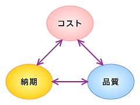

<html><body>
<h2>納期優先のツケを後で払うことになる開発方法</h2>

<h3>QCTのバランスの重要性</h3>

　顧客に製品やサービスを提供したときに顧客が満足するかどうかは、Q （Quality）、C（Cost）、T（Time）の3つの要素で決まる（<strong>図1</strong>）。品質（Q）が良く、コスト（C）が安く、納期（T）が早ければ顧客は満足してくれる。ここで難しいのは、この3つはトレードオフの関係になることが多いことである。多くの場合、T（納期）ばかりにこだわるとQ（品質）が落ちる、C（コスト）要求を厳しくすると、T（納期）が遅れたりする。

<!--CAP-->

<small><strong>図1　顧客の満足度を計る3要素</strong></small>

<!--CAPEND-->
<h3>納期を優先しがちなプロジェクトマネージャ</h3>

　ほとんどのプロジェクトマネージャは、この3つを対等に扱わずに、納期を優先して管理を行ってしまう。毎週の進ちょく会議で、とりあえずスケジュールが守られていると安心する。しかし、それで本当に問題はないのであろうか。

　一番多いのは、品質を犠牲にして納期を守っているケースである。人は納期が迫ってきていて、どうしても遅らせるわけにはいかない場合、手抜きをして納期を守ろうとする。手抜きの内容としては、以下のようなものがある。

<ul>
<li>テストをいい加減に済ましてしまう</li>
<li>例外時の処理をあまり考慮せずに済ましてしまう</li>
<li>安易にほかのプログラムから似たルーティンを持ってきて、あまりチェックをせずに手直ししてプログラミングに使用する</li>
</ul>

　上記のことが行われると、ソフトウェアの品質は非常に悪くなる。品質があまりにも悪いと、最悪、あとで全面的な手直しをするはめになってしまい、かえってコストが膨らむことになる。

　次に多いのが、コスト無視で納期を守っているケースである。予定より多い数の人員をつぎ込んでいたり、担当者に残業をさせている場合がこれに当たる。確かに納期を守れてはいるが、これでは実際のコストが予算よりも多くかかり、最終的にコストが予算を大幅に超過してしまう可能性が高い。

<h3>QCTを対等に扱うプロジェクト管理</h3>

　すでに述べたように、プロジェクトにおいては、QCTのどれか１つでも満足できない結果であれば、プロジェクトが成功したとはいえない。そうであれば、T（納期）を管理するだけでよいはずがない。プロジェクトは、QCT3つすべてを常に管理していなければならない。次にその方法を紹介する。

<h3>納期だけに翻弄されないための、TとQの同時チェック</h3>

　まず大事なことは、Q（品質）を定常的に管理することである。毎週の進ちょくミーティングで、スケジュール管理と同時に品質チェックも行うことである。これは、決して簡単なことではない。

　最も大事なことは、成果物の完成とそのテストやレビューをできる限り近付けることだ。例えば、プログラムが完成したら、すぐに単体テストを実施させ、その結果を報告させることである。このときに必ず、テスト結果をテスト記録などで確認し、品質をチェックする。これでTとQを同時にチェックできる。成果物の完成と品質のチェックが同時にできれば、たとえ品質に問題があったとしても、すぐリカバリーができ、大きな問題にはならずに済む。最初に品質をチェックせず、納品時に品質のチェックを行うと、品質上の問題が出たときにリカバリーができず、大きな問題に発展してしまう。

<h3>TとCも同時チェック</h3>

　コストの管理も本来は進ちょくミーティングのタイミングで同時に行うべきである。多くの会社は、コストの管理を進ちょくミーティングのタイミングとは別に、月次などのタイミングで行っている。これでは、コストオーバーに対して、タイムリーに対策が打てない。それだけでなく、進ちょく管理とコスト管理が結びついていないために、プロジェクトの途中では正確なコスト管理ができないことになる。

　これを解決するためには、進ちょくとコストを同時に管理する仕組みが必要である。この代表的な手法がアーンドバリュー法（参照：「<A HREF="http://jibun.atmarkit.co.jp/lskill01/rensai/pm_kiso05/pm_kiso01.html" target="_blank">結構ややこしいぞ！ アーンド・バリュー計算と分析</A>」）である。これは、プロジェクトの計画や成果物、労働力を同じ指標（出来高）に換算して管理する手法で、プロジェクトの遅延やコスト超過を早期に発見できる。この手法は、国際的には非常に広く使用されているが、日本ではまだあまり普及していない。しかし、ほかに進ちょくとコストを同時に管理できる手法がないことを考えると、もう少し積極的にこの手法の採用を考えるべきであろう。

</body></html>

