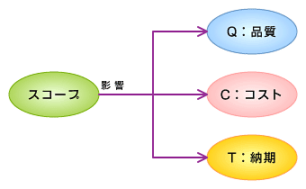

<html><body>
<h2>顧客要求を安易に受けてしまう人の良いSE</h2>

<h3>人の良いSE</h3>

　SEは人の良い人が多い（と筆者は思う）。顧客から頼まれると「何とかしてあげなくては」と思ってしまう。しかし、これがプロジェクト全体に大きな影響を与えてしまうだけでなく、顧客にも迷惑を掛けてしまうことがある。要件定義が終わってからでも、顧客からいろいろな要望が挙がってくることは多い。これら全部に応えていると、当初立てたスケジュールが狂ってくる。結果として、顧客が要望していたスケジュールを守れないことになる。

　品質にも大きな問題が出てくることが多くなる。途中で仕様が変わると、設計やプログラミングに手戻りが発生する。手戻りが発生すると、ほとんどの場合品質は落ちてしまう。

　結果として、納期も守れず、品質も悪いシステムを納品してしまうことになる。

<h3>スコープのブレはプロジェクト失敗の最大の要因</h3>

　このように仕様が頻繁に変更になるのは、プロジェクトのスコープが安定していないことを示している。スコープがぶれて安定していないプロジェクトは、うまくいくはずがないというのが、プロジェクトマネジメントの常識である。

　プロジェクトが成功するということは、Q（Quality）、C（Cost）、T（Time）の3つが満足できる状態で終わることである。品質が良く、コストも妥当で、納期が守れれば、プロジェクトは成功したといえる。しかし、スコープの変更は、これら3つの要素すべてに影響を与えてしまう。

　スコープの変更があると各種管理が煩雑（はんざつ）になり、作業の漏れが発生しやすくなる。手戻りが発生すると、関連する個所の修正漏れも発生しやすくなる。スコープが増大すれば、当然作業量も増加する。全体の開発量が膨らまない場合でも、手戻りなどによる作業量の増加は避けられない。このように作業量が増加すれば、スケジュールは守れなくなるし、コストも膨らんでしまうことになる。

<!--CAP-->

<small><strong>スコープの変更が及ぼす影響先</strong></small>

<!--CAPEND-->
<h3>スコープ変更の管理</h3>

　スコープ変更の影響は非常に大きいので、ないに越したことはない。しかし、実際にはスコープの変更に応じなくてはならない場合が多い。例えば、それを認めないとシステムが実際の業務で使用できないようなケースである。このような場合には、ある程度スコープの変更を認めないわけにはいかないのであるが、この際に重要なことは、変更管理の手順に従って、変更を受け付けることである。間違ってもSEが個人で変更要求を受けるようなことはしてはならない。PMBOKでは、このような変更管理の仕組みのことを「変更管理システム」と呼んでおり、次のような内容を含めるべきだと述べている。

<ul>
<li>書類作成</li>
<li>追跡システム</li>
<li>変更権限を持つ承認レベル</li>
</ul>
<h3>最終的な変更受諾の可否は誰がするか</h3>

　顧客から提出された変更要求を許諾する権限は、顧客と折衝するPM（プロジェクトマネージャ）に持たせない方がよい。顧客と日常接しているPMがこの権限を持ってしまうと、どうしても顧客の無理な要求を断りにくくなる。それでは、どうしたらよいかというと、変更管理委員会（CCB：Change Control Board）を設置して、ここで変更受諾の可否を決定することである。こうすることによって、受諾の可否の判断をしがらみにとらわれずに冷静かつ的確に判断できるようになる。

　この変更管理委員会は、プロジェクトメンバーの中で設置する場合もあるし、上司や社内関連部門を参加させる場合もあるが、プロジェクト外のメンバーを入れた方が、より客観的な判断が下せると思われる。

<h3>変更要求に対する顧客との調整</h3>

　あまり、しゃくし定規に変更要求を拒否していると、顧客の機嫌を損ねる場合もあるので注意が必要である。第一に重要なことは、契約において仕様変更への対応方法をきちんと決めておくことである。具体的には、変更要求をどのように申請し、それに対してどのように採用の可否を決めていくかを決めておくことが重要である。

　また、顧客と交渉する際に、自分たちの都合で変更要求を拒否するという姿勢ではなく、変更要求を受けることがプロジェクト全体にどれだけ影響があるかを説明しなくてはならない。変更要求の多さが結局は顧客にとっても良い結果をもたらさないということをしっかり伝えることが重要である。

</body></html>

